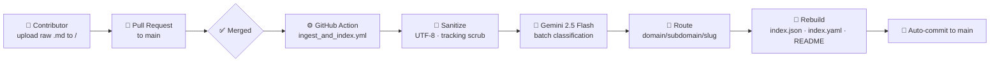

<div align="center">

# 🛡️ awensome_cybersecurity

**The open, curated & fully-automated cybersecurity knowledge base by [BlueRingsLabs](https://github.com/BlueRingsLabs).**

[](LICENSE)
[](https://github.com/BlueRingsLabs/awensome_cybersecurity/actions/workflows/ingest_and_index.yml)
[](#-resource-index)
[](CONTRIBUTING.md)
[](CODE_OF_CONDUCT.md)

*Books · Research papers · Field notes · Cheat sheets — classified, sanitized and indexed automatically.*

</div>

---

## 🎯 Mission & Vision

Cybersecurity knowledge is scattered across blogs, PDFs, gists and personal notes. **BlueRingsLabs** exists to
turn that chaos into a single, browsable, machine-readable arsenal — with **zero friction for contributors**.

Our core value proposition:

1. **Drop it at the root.** Contributors never classify, format or organize anything. You upload a raw
   Markdown note straight into the repository root (`/`) via a Pull Request — that's it.
2. **The pipeline does the rest.** On merge to `main`, a GitHub Actions workflow powered by an LLM
   (Gemini 2.5 Flash) inspects every incoming file, sanitizes it, classifies it into the right domain,
   renames it consistently, and regenerates all catalogs — [`README.md`](README.md),
   [`index.json`](index.json) and [`index.yaml`](index.yaml).
3. **Open forever.** MIT-licensed, community-governed, tracked publicly on our
   [Kanban roadmap](https://github.com/orgs/BlueRingsLabs/projects).

---

## 🗺️ Repository Map

```text
awensome_cybersecurity/
├── 01_literature/          # 📚 Books, summaries & theoretical notes
│   ├── blue_team/              # Defense, detection & response
│   ├── red_team/               # Offensive security & pentesting
│   ├── malware_analysis/       # Malware, forensics & SOC operations
│   ├── reverse_engineering/    # Exploit development & RE
│   └── threat_intelligence/    # OSINT, threat hunting & CTI
├── 02_papers/              # 📄 Technical research papers & whitepapers
│   └── (same five subdomains)
├── 03_web_and_posts/       # 🌐 Articles, blog posts & web resources
│   ├── (five subdomains)
│   └── unclassified/           # Quarantine awaiting automated re-classification
├── index.json              # 🤖 Canonical machine-readable catalog (API-ready)
├── index.yaml              # 🤖 Compact YAML mirror of the catalog
├── .github/
│   ├── scripts/                # Ingestion engine (classify_and_index.py, catalog_lib.py…)
│   └── workflows/              # ingest_and_index.yml CI/CD pipeline
├── CONTRIBUTING.md         # 🤝 The one-step submission workflow
├── CODE_OF_CONDUCT.md      # ⚖️ Contributor Covenant 2.1
└── LICENSE                 # ⚖️ MIT © 2026 Blue Rings Labs
```

| Domain | What lives here | Audience |
| :----- | :-------------- | :------- |
| `01_literature` | Books, long-form summaries, study notes | Deep learners |
| `02_papers` | Research papers, whitepapers, frameworks | Researchers & architects |
| `03_web_and_posts` | Blog posts, cheat sheets, tool write-ups | Practitioners |

| Subdomain | Focus |
| :-------- | :---- |
| 🔵 `blue_team` | Hardening, SOC/SIEM, incident response, GRC, zero trust |
| 🔴 `red_team` | Pentesting, adversary emulation, privilege escalation, bug bounty |
| ☠️ `malware_analysis` | Malware research, ransomware, DFIR, YARA, sandboxing |
| 🔬 `reverse_engineering` | Binaries, shellcode, buffer overflows, Ghidra/IDA, exploit dev |
| 🕵️ `threat_intelligence` | OSINT, CTI, APT profiling, ATT&CK, honeypots, anonymity ops |

---

## 🚀 Quickstart

```bash
git clone https://github.com/BlueRingsLabs/awensome_cybersecurity.git
cd awensome_cybersecurity

# Browse visually → README table below, or programmatically:
jq '.resources[] | select(.subdomain=="osint") | {title, path}' index.json
python3 -c "import yaml; c=yaml.safe_load(open('index.yaml')); print(c['stats'])"
```

### 🤖 Programmatic access

Both catalogs share schema `$schema_version: 1.0.0`:

| Field | Description |
| :---- | :------------ |
| `taxonomy` | Full domain/subdomain tree with live per-folder counts |
| `stats` | Totals per domain and per subdomain |
| `resources[]` | `id`, `title`, `path`, `domain`, `subdomain`, `type`, `year`, `language`, `description`, `tags`, `size_bytes`, `updated_at` |

Every ingested file also carries YAML front-matter (`classifier`, `confidence`, `original_filename`)
for full auditability of AI decisions.

---

## 🔄 How automation works



Rate-limit aware (≤ 12 req/min, batched 12 files/call), retry-hardened (exponential backoff on 429),
with a deterministic keyword fallback so ingestion **never** fails — worst case files land in
`unclassified/` for later review. See [`.github/scripts/classify_and_index.py`](.github/scripts/classify_and_index.py).

---

## 🤝 Contributing

One rule: **put your raw Markdown file in the repository root and open a PR.** No folder trees,
no naming conventions, no index editing. Full guide → [CONTRIBUTING.md](CONTRIBUTING.md).
Please respect our [Code of Conduct](CODE_OF_CONDUCT.md).

## ⚖️ License & Governance

Released under the [MIT License](LICENSE) © 2026 Blue Rings Labs – Gonzalo Romero.
Roadmap & tasks: public Kanban — *Cybersecurity Knowledge Base Roadmap*.

---

<!-- AUTO-INDEX:START -->
## 📚 Resource Index

The tables below are **generated automatically** by the ingestion pipeline on every
merge to `main` — please do not edit them by hand (see
[`CONTRIBUTING.md`](CONTRIBUTING.md)). The canonical machine-readable catalogs live in
[`index.json`](index.json) and [`index.yaml`](index.yaml).

> **505 curated resources** indexed — **291** 01_literature, **41** 02_papers, **173** 03_web_and_posts.
> Last automated update: `2026-10-03T23:05:41+00:00`.

| Subdomain | Title | Year | Language | Link |
| :-------- | :---- | :--: | :------: | :--- |
| `blue_team` | Red Team Tradecraft Complete Guide | 2026 | en | [📄 view](01_literature/blue_team/red_team_tradecraft_complete_guide.md) |
| `blue_team` | WebSurface - web attack surface discovery | 2026 | en | [📄 view](01_literature/blue_team/2026_websurface.md) |
| `blue_team` | Cloudsecurityplaybookvol1 | 2025 | en | [📄 view](01_literature/blue_team/cloudsecurityplaybookvol1.md) |
| `blue_team` | The Linux Security Journey | 2025 | en | [📄 view](01_literature/blue_team/the_linux_security_journey.md) |
| `blue_team` | Threat Modeling in Modern Security Programs | 2025 | en | [📄 view](01_literature/blue_team/2025_threat-modeling-in-modern-security-programs.md) |
| `blue_team` | Toryfikator | 2025 | en | [📄 view](01_literature/blue_team/2025_toryfikator.md) |
| `blue_team` | Cyber Governance Code Of Practice | 2024 | en | [📄 view](01_literature/blue_team/cyber_governance_code_of_practice.md) |
| `blue_team` | Swap Cab | 2024 | en | [📄 view](01_literature/blue_team/2024_swap-cab.md) |
| `blue_team` | Learning to hack | 2023 | en | [📄 view](01_literature/blue_team/2023_learning-to-hack.md) |
| `blue_team` | Nsa And Cisa Top 10 | 2023 | en | [📄 view](01_literature/blue_team/nsa_and_cisa_top_10.md) |
| `blue_team` | This script prints a greeting and the current date | 2023 | en | [📄 view](01_literature/blue_team/shell_scripting.md) |
| `blue_team` | Windows security and privacy | 2023 | en | [📄 view](01_literature/blue_team/2023_windows-security-and-privacy.md) |
| `blue_team` | Worth checking ep.1 | 2023 | en | [📄 view](01_literature/blue_team/2023_worth-checking-1.md) |
| `blue_team` | Chatgpt For Cybersecurity 1 | 2022 | en | [📄 view](01_literature/blue_team/chatgpt_for_cybersecurity_1.md) |
| `blue_team` | Introduo Ao Mitre Att Ck E Ao Cyber Kill Chain | 2021 | en | [📄 view](01_literature/blue_team/introduo_ao_mitre_att_ck_e_ao_cyber_kill_chain.md) |
| `blue_team` | Pentest Iot And Ot Overview | 2021 | en | [📄 view](01_literature/blue_team/pentest_iot_and_ot_overview.md) |
| `blue_team` | TLS certificate for onion site | 2021 | en | [📄 view](01_literature/blue_team/2021_tls-for-onion.md) |
| `blue_team` | Top security browser plugins | 2020 | en | [📄 view](01_literature/blue_team/2020_top-security-browser-plugins.md) |
| `blue_team` | Pentest of an FTP Server | 2019 | en | [📄 view](01_literature/blue_team/2019_ftp-testing.md) |
| `blue_team` | Send emails by local applications only | 2018 | en | [📄 view](01_literature/blue_team/2018_send-emails-by-local-applications-only.md) |
| `blue_team` | Red Team X Blue Team | 2016 | en | [📄 view](01_literature/blue_team/red_team_x_blue_team.md) |
| `blue_team` | Instagram Social Network Security | 2000 | en | [📄 view](01_literature/blue_team/instagram_social_network_security.md) |
| `blue_team` | Active Directory Assesment | — | en | [📄 view](01_literature/blue_team/active_directory_assesment.md) |
| `blue_team` | Create a new threat model | — | en | [📄 view](01_literature/blue_team/devsec_ops_guides.md) |
| `blue_team` | Cyber Security Complete Journey Red Team 1 | — | en | [📄 view](01_literature/blue_team/cyber_security_complete_journey_red_team_1.md) |
| `blue_team` | Cybersecurity And Cyberbullying Education For Kids | — | en | [📄 view](01_literature/blue_team/cybersecurity_and_cyberbullying_education_for_kids.md) |
| `blue_team` | Cybersecurity For Kids Pt Br | — | pt | [📄 view](01_literature/blue_team/cybersecurity_for_kids_pt_br.md) |
| `blue_team` | How To Start At Once In The Pentest | — | en | [📄 view](01_literature/blue_team/how_to_start_at_once_in_the_pentest.md) |
| `blue_team` | Infosec Proeficiency Colors | — | en | [📄 view](01_literature/blue_team/infosec_proeficiency_colors.md) |
| `blue_team` | Internet Safety Sexual Predators And Stalkers How To Protect Yourself | — | en | [📄 view](01_literature/blue_team/internet_safety_sexual_predators_and_stalkers_how_to_protect_yourself.md) |
| `blue_team` | Iot Security Guide | — | en | [📄 view](01_literature/blue_team/iot_security_guide.md) |
| `blue_team` | Low Cost Red Team Tools | — | en | [📄 view](01_literature/blue_team/low_cost_red_team_tools.md) |
| `blue_team` | Password Cracking My Sql | — | en | [📄 view](01_literature/blue_team/password_cracking_my_sql.md) |
| `blue_team` | Password Cracking Postrgresql | — | en | [📄 view](01_literature/blue_team/password_cracking_postrgresql.md) |
| `blue_team` | Red Team Operations Development Pt 1 | — | pt | [📄 view](01_literature/blue_team/red_team_operations_development_pt_1.md) |
| `blue_team` | Red Team Pentest English | — | en | [📄 view](01_literature/blue_team/red_team_pentest_english.md) |
| `blue_team` | Security Operation Center And Analysis | — | en | [📄 view](01_literature/blue_team/security_operation_center_and_analysis.md) |
| `blue_team` | Tdc2021 Mitre Att Ck | — | en | [📄 view](01_literature/blue_team/tdc2021_mitre_att_ck.md) |
| `blue_team` | The Complete Guide For Cyber Security Career | — | en | [📄 view](01_literature/blue_team/the_complete_guide_for_cyber_security_career.md) |
| `blue_team` | The Complete Guide For Cyber Security Career English | — | en | [📄 view](01_literature/blue_team/the_complete_guide_for_cyber_security_career_english.md) |
| `blue_team` | The Hackers Guide To Llms | — | en | [📄 view](01_literature/blue_team/the_hackers_guide_to_llms.md) |
| `blue_team` | What It Takes To Be A Red Team | — | it | [📄 view](01_literature/blue_team/what_it_takes_to_be_a_red_team.md) |
| `malware_analysis` | Server Upgrade | 2023 | en | [📄 view](01_literature/malware_analysis/2023_server-upgrade.md) |
| `malware_analysis` | CMS Vulnerability Scanners | 2022 | en | [📄 view](01_literature/malware_analysis/2022_cms-vulnerability-scanners.md) |
| `malware_analysis` | Malwareanalysis 101 | 2022 | en | [📄 view](01_literature/malware_analysis/malwareanalysis_101.md) |
| `malware_analysis` | Windows Defender is enough, if you harden it | 2022 | en | [📄 view](01_literature/malware_analysis/2022_windows-defender.md) |
| `malware_analysis` | Backup your data | 2021 | en | [📄 view](01_literature/malware_analysis/2021_backup-your-data.md) |
| `malware_analysis` | Malware Hunting Threat Hunter Overview 1 | 2021 | en | [📄 view](01_literature/malware_analysis/malware_hunting_threat_hunter_overview_1.md) |
| `malware_analysis` | Yet Another Ridiculous Acronym | 2021 | en | [📄 view](01_literature/malware_analysis/2021_yara.md) |
| `malware_analysis` | 8BitDo gamepads | 2020 | en | [📄 view](01_literature/malware_analysis/2020_8bitdo-gamepads.md) |
| `malware_analysis` | Test environment | 2020 | en | [📄 view](01_literature/malware_analysis/2020_test-environment.md) |
| `malware_analysis` | Malware analysis | 2019 | en | [📄 view](01_literature/malware_analysis/2019_malware-analysis.md) |
| `malware_analysis` | Introduction Cyber Security | 2017 | en | [📄 view](01_literature/malware_analysis/introduction_cyber_security.md) |
| `malware_analysis` | Network Security Best Practices | 1981 | en | [📄 view](01_literature/malware_analysis/network_security_best_practices.md) |
| `malware_analysis` | 100 Security Operation Center Tools | — | en | [📄 view](01_literature/malware_analysis/100_security_operation_center_tools.md) |
| `malware_analysis` | Av And Edr Bypass Techniques For New Hackers Update 2022 | — | en | [📄 view](01_literature/malware_analysis/av_and_edr_bypass_techniques_for_new_hackers_update_2022.md) |
| `malware_analysis` | Computer Forensic Overview Pt | — | pt | [📄 view](01_literature/malware_analysis/computer_forensic_overview_pt.md) |
| `malware_analysis` | Container Security Overview Pt 1 | — | pt | [📄 view](01_literature/malware_analysis/container_security_overview_pt_1.md) |
| `malware_analysis` | Cyber Security For Kids | — | en | [📄 view](01_literature/malware_analysis/cyber_security_for_kids.md) |
| `malware_analysis` | Cybersecurity For Kids English | — | en | [📄 view](01_literature/malware_analysis/cybersecurity_for_kids_english.md) |
| `malware_analysis` | Low Cost Soc | — | en | [📄 view](01_literature/malware_analysis/low_cost_soc.md) |
| `malware_analysis` | Mastering Fortigate | — | en | [📄 view](01_literature/malware_analysis/mastering_fortigate.md) |
| `malware_analysis` | Ms365 Security Checklist | — | en | [📄 view](01_literature/malware_analysis/ms365_security_checklist.md) |
| `malware_analysis` | Own Your Space Teen Book | — | en | [📄 view](01_literature/malware_analysis/own_your_space_teen_book.md) |
| `malware_analysis` | Programao C E C Para Segurana Ofensiva Digital | — | en | [📄 view](01_literature/malware_analysis/programao_c_e_c_para_segurana_ofensiva_digital.md) |
| `malware_analysis` | Security Operation Center 40 Tools | — | en | [📄 view](01_literature/malware_analysis/security_operation_center_40_tools.md) |
| `malware_analysis` | Security Operation Center Operations Development | — | en | [📄 view](01_literature/malware_analysis/security_operation_center_operations_development.md) |
| `malware_analysis` | The Purple Book On Cyber Security | — | en | [📄 view](01_literature/malware_analysis/the_purple_book_on_cyber_security.md) |
| `malware_analysis` | Web Pentesting Checklist By Joas | — | en | [📄 view](01_literature/malware_analysis/web_pentesting_checklist_by_joas.md) |
| `malware_analysis` | Windows Api For Red Team 102 English | — | en | [📄 view](01_literature/malware_analysis/windows_api_for_red_team_102_english.md) |
| `malware_analysis` | ①This happened when they tried to type something right after we sent the malicious ARP | — | en | [📄 view](01_literature/malware_analysis/computer_systems_security.md) |
| `red_team` | Basic Onion Check | 2025 | en | [📄 view](01_literature/red_team/2025_basic-onion-check.md) |
| `red_team` | Genai Red Teaming Guide | 2025 | en | [📄 view](01_literature/red_team/genai_red_teaming_guide.md) |
| `red_team` | Fuzz the world | 2024 | en | [📄 view](01_literature/red_team/2024_fuzz-the-world.md) |
| `red_team` | SysPwn - App Launcher | 2024 | en | [📄 view](01_literature/red_team/2024_syspwn-app-launcher.md) |
| `red_team` | Certified Red Team Physical Pentest Leader Quick Training | 2023 | en | [📄 view](01_literature/red_team/certified_red_team_physical_pentest_leader_quick_training.md) |
| `red_team` | How ChatGPT helped me to code stuff | 2023 | en | [📄 view](01_literature/red_team/2023_chatgpt.md) |
| `red_team` | Redteam Scenarios | 2023 | en | [📄 view](01_literature/red_team/redteam_scenarios.md) |
| `red_team` | I am not that hacker you are looking for | 2022 | en | [📄 view](01_literature/red_team/2022_i-am-not.md) |
| `red_team` | Let's hack some SMB | 2022 | en | [📄 view](01_literature/red_team/2022_smb-hacking.md) |
| `red_team` | with a password | 2022 | en | [📄 view](01_literature/red_team/activate_directory_security_guide.md) |
| `red_team` | Cyber Security Career For Children Pt 1 | 2020 | pt | [📄 view](01_literature/red_team/cyber_security_career_for_children_pt_1.md) |
| `red_team` | A Detailed Guide On Kerbrute | 2019 | en | [📄 view](01_literature/red_team/a_detailed_guide_on_kerbrute.md) |
| `red_team` | Create a Backup: ls -R \| cpio -ov /Backup/test.cpio | 2019 | en | [📄 view](01_literature/red_team/basic_knowldges_of_pentesting.md) |
| `red_team` | Website analysis | 2019 | en | [📄 view](01_literature/red_team/2019_website-analysis.md) |
| `red_team` | Penetration Testing Report | 2013 | en | [📄 view](01_literature/red_team/penetration_testing_report.md) |
| `red_team` | Pentest With Metasploit Overview | 2003 | en | [📄 view](01_literature/red_team/pentest_with_metasploit_overview.md) |
| `red_team` | 30 Days Of Practice Pentest | — | en | [📄 view](01_literature/red_team/30_days_of_practice_pentest.md) |
| `red_team` | Adversary Emulation And Cracking The Bridge Overview | — | en | [📄 view](01_literature/red_team/adversary_emulation_and_cracking_the_bridge_overview.md) |
| `red_team` | Adversary Emulation Com Cobalt Strike | — | en | [📄 view](01_literature/red_team/adversary_emulation_com_cobalt_strike.md) |
| `red_team` | Adversary Simulation With Caldera And Mitre | — | en | [📄 view](01_literature/red_team/adversary_simulation_with_caldera_and_mitre.md) |
| `red_team` | Anonymous Logins For Pentester | — | en | [📄 view](01_literature/red_team/anonymous_logins_for_pentester.md) |
| `red_team` | Art Of Post Exploitation | — | en | [📄 view](01_literature/red_team/art_of_post_exploitation.md) |
| `red_team` | Certified Red Team Leader Rto Ii Overview To Study | — | en | [📄 view](01_literature/red_team/certified_red_team_leader_rto_ii_overview_to_study.md) |
| `red_team` | Check if config map exists | — | en | [📄 view](01_literature/red_team/kubernetes_exploitation_introduction_cheatsheet.md) |
| `red_team` | Como Gerenciar Um Red Team | — | en | [📄 view](01_literature/red_team/como_gerenciar_um_red_team.md) |
| `red_team` | Competncias Essenciais Para Liderar Uma Equipe De Pentest | — | de | [📄 view](01_literature/red_team/competncias_essenciais_para_liderar_uma_equipe_de_pentest.md) |
| `red_team` | Credential Dumping Sam | — | en | [📄 view](01_literature/red_team/credential_dumping_sam.md) |
| `red_team` | First obtain systeminfo | — | en | [📄 view](01_literature/red_team/privilege_escalation.md) |
| `red_team` | Fundamentals Cracking The Perimeter | — | en | [📄 view](01_literature/red_team/fundamentals_cracking_the_perimeter.md) |
| `red_team` | Hacking Beginner To Expert Guide | — | en | [📄 view](01_literature/red_team/hacking_beginner_to_expert_guide.md) |
| `red_team` | Import the PowerShell module | — | en | [📄 view](01_literature/red_team/pwning_the_domain_series_with_credentials.md) |
| `red_team` | Iniciando Sua Carreira Em Pentest | — | en | [📄 view](01_literature/red_team/iniciando_sua_carreira_em_pentest.md) |
| `red_team` | Linux Pentesting | — | en | [📄 view](01_literature/red_team/linux_pentesting.md) |
| `red_team` | Load the PE file | — | en | [📄 view](01_literature/red_team/windows_api_for_red_team_101_english.md) |
| `red_team` | Offensive Security Labs Reference | — | en | [📄 view](01_literature/red_team/offensive_security_labs_reference.md) |
| `red_team` | Offensive Security Materials For Studies And Certifications | — | en | [📄 view](01_literature/red_team/offensive_security_materials_for_studies_and_certifications.md) |
| `red_team` | Offsec Certification And Courses 2024 | — | en | [📄 view](01_literature/red_team/offsec_certification_and_courses_2024.md) |
| `red_team` | Oscp Labs To Practice 2023 | — | en | [📄 view](01_literature/red_team/oscp_labs_to_practice_2023.md) |
| `red_team` | Penetration Testing Guide | — | en | [📄 view](01_literature/red_team/penetration_testing_guide.md) |
| `red_team` | Pentest And Red Team Books | — | en | [📄 view](01_literature/red_team/pentest_and_red_team_books.md) |
| `red_team` | Pentest Best Practice Checklist | — | en | [📄 view](01_literature/red_team/pentest_best_practice_checklist.md) |
| `red_team` | Pentest Skills Development | — | en | [📄 view](01_literature/red_team/pentest_skills_development.md) |
| `red_team` | Pulled from https://github.com/coreruleset/coreruleset/blob/v3.4/dev/rules/REQUEST-941 | — | en | [📄 view](01_literature/red_team/elearnsecurity_ewptx_notes_basic_by_joas.md) |
| `red_team` | Python For Hackers Bootcamp | — | en | [📄 view](01_literature/red_team/python_for_hackers_bootcamp.md) |
| `red_team` | Red Team Operations Overview Pt 2 | — | pt | [📄 view](01_literature/red_team/red_team_operations_overview_pt_2.md) |
| `red_team` | Red Team Toolkit 1 | — | en | [📄 view](01_literature/red_team/red_team_toolkit_1.md) |
| `red_team` | Red Team Toolkit Guide | — | en | [📄 view](01_literature/red_team/red_team_toolkit_guide.md) |
| `red_team` | Remote Desktop Penetration Testing Port 3389 | — | en | [📄 view](01_literature/red_team/remote_desktop_penetration_testing_port_3389.md) |
| `red_team` | Resume Pentest Career By Joas A Santos | — | en | [📄 view](01_literature/red_team/resume_pentest_career_by_joas_a_santos.md) |
| `red_team` | use -d for Detach Oppened session | — | en | [📄 view](01_literature/red_team/linux_privilege_escalation.md) |
| `red_team` | Web Security Guide | — | en | [📄 view](01_literature/red_team/web_security_guide.md) |
| `red_team` | Windows Api For Red Team 101 Portuguese | — | en | [📄 view](01_literature/red_team/windows_api_for_red_team_101_portuguese.md) |
| `red_team` | Windows Privilege Escalation Server Operator Group | — | en | [📄 view](01_literature/red_team/windows_privilege_escalation_server_operator_group.md) |
| `red_team` | Winrm Penetration Testing | — | en | [📄 view](01_literature/red_team/winrm_penetration_testing.md) |
| `reverse_engineering` | DefectDojo – Setup, Workflow and Real Usage | 2026 | en | [📄 view](01_literature/reverse_engineering/2026_defectdojo.md) |
| `reverse_engineering` | ScopeWise - Yet Another Recon Script | 2026 | en | [📄 view](01_literature/reverse_engineering/2026_sopewise.md) |
| `reverse_engineering` | Craft malicious serialized data with arbitrary code execution | 2024 | en | [📄 view](01_literature/reverse_engineering/attacking_php_application.md) |
| `reverse_engineering` | Miyoo Mini Plus | 2023 | en | [📄 view](01_literature/reverse_engineering/2023_miyoo-mini-plus.md) |
| `reverse_engineering` | Hacking Windows | 2022 | en | [📄 view](01_literature/reverse_engineering/hacking_windows.md) |
| `reverse_engineering` | Overview Windows Api S And Internals Reverse Engineering | 2020 | en | [📄 view](01_literature/reverse_engineering/overview_windows_api_s_and_internals_reverse_engineering.md) |
| `reverse_engineering` | Easy GPG | 2019 | en | [📄 view](01_literature/reverse_engineering/2019_easy-gpg.md) |
| `reverse_engineering` | Note that print is a function | 2019 | en | [📄 view](01_literature/reverse_engineering/byte_of_python.md) |
| `reverse_engineering` | Windows post-exploitation | 2019 | en | [📄 view](01_literature/reverse_engineering/2019_windows-post-exploitation.md) |
| `reverse_engineering` | Buffer Overflow For Beginners Joas | 2017 | en | [📄 view](01_literature/reverse_engineering/buffer_overflow_for_beginners_joas.md) |
| `reverse_engineering` | Api Security Handbook | — | en | [📄 view](01_literature/reverse_engineering/api_security_handbook.md) |
| `reverse_engineering` | Blockchain And Smart Contract Testing Security | — | en | [📄 view](01_literature/reverse_engineering/blockchain_and_smart_contract_testing_security.md) |
| `reverse_engineering` | Buffer Overflow Introduction | — | en | [📄 view](01_literature/reverse_engineering/buffer_overflow_introduction.md) |
| `reverse_engineering` | Ceh Fundamentals | — | en | [📄 view](01_literature/reverse_engineering/ceh_fundamentals.md) |
| `reverse_engineering` | Enumerao De Grupos De Ti E Segurana Para Tech Recruiters | — | de | [📄 view](01_literature/reverse_engineering/enumerao_de_grupos_de_ti_e_segurana_para_tech_recruiters.md) |
| `reverse_engineering` | Game Hacking 1 Anti Cheat Bypass | — | en | [📄 view](01_literature/reverse_engineering/game_hacking_1_anti_cheat_bypass.md) |
| `reverse_engineering` | Introduo Ao Desenvolvimento De Exploits | — | de | [📄 view](01_literature/reverse_engineering/introduo_ao_desenvolvimento_de_exploits.md) |
| `reverse_engineering` | Programming Language For Hacking Books | — | en | [📄 view](01_literature/reverse_engineering/programming_language_for_hacking_books.md) |
| `reverse_engineering` | Shellcode Development 2 | — | en | [📄 view](01_literature/reverse_engineering/shellcode_development_2.md) |
| `reverse_engineering` | Wstg Web Application Security Testing Owasp Mind Map | — | en | [📄 view](01_literature/reverse_engineering/wstg_web_application_security_testing_owasp_mind_map.md) |
| `threat_intelligence` | GPGWrap - simple GUI for GPG | 2026 | en | [📄 view](01_literature/threat_intelligence/2026_gpgwrap.md) |
| `threat_intelligence` | HexStrike AI on Kali with Roo Code | 2026 | en | [📄 view](01_literature/threat_intelligence/2026_hexstrikeai-setup.md) |
| `threat_intelligence` | Practical Recon Automation with ReconFTW | 2026 | en | [📄 view](01_literature/threat_intelligence/2026_reconftw.md) |
| `threat_intelligence` | Ai Bias In Law Enforcement A Practical Guide | 2025 | en | [📄 view](01_literature/threat_intelligence/ai_bias_in_law_enforcement_a_practical_guide.md) |
| `threat_intelligence` | Ask for the folder name | 2025 | en | [📄 view](01_literature/threat_intelligence/prompt_engineering_google.md) |
| `threat_intelligence` | Building a Local AI Environment | 2025 | en | [📄 view](01_literature/threat_intelligence/2025_building-local-ai-environment.md) |
| `threat_intelligence` | Cool selfhosted solutions | 2025 | en | [📄 view](01_literature/threat_intelligence/2025_cool-selfhosted-solutions.md) |
| `threat_intelligence` | Hacker Shelf | 2025 | en | [📄 view](01_literature/threat_intelligence/2025_hacker-shelf.md) |
| `threat_intelligence` | Rclone backup | 2025 | en | [📄 view](01_literature/threat_intelligence/2025_rclone-backup.md) |
| `threat_intelligence` | Running own Tor Relay on a VPS | 2025 | en | [📄 view](01_literature/threat_intelligence/2025_tor-relay.md) |
| `threat_intelligence` | Understanding Data 0asecurity Risk | 2025 | en | [📄 view](01_literature/threat_intelligence/understanding_data_0asecurity_risk.md) |
| `threat_intelligence` | Uptime monitoring | 2025 | en | [📄 view](01_literature/threat_intelligence/2025_uptime-monitoring.md) |
| `threat_intelligence` | Whonix for KVM | 2025 | en | [📄 view](01_literature/threat_intelligence/2025_whonix-for-kvm.md) |
| `threat_intelligence` | Attacking Nginx | 2024 | en | [📄 view](01_literature/threat_intelligence/attacking_nginx.md) |
| `threat_intelligence` | Auto resize X screen for Kali on KVM | 2024 | en | [📄 view](01_literature/threat_intelligence/2024_auto-resize-x-screen-for-kali-on-kvm.md) |
| `threat_intelligence` | Basic access authentication bruteforce | 2024 | en | [📄 view](01_literature/threat_intelligence/2024_basic-access-authentication-bruteforce.md) |
| `threat_intelligence` | Cyber Security Incident Management Plan | 2024 | en | [📄 view](01_literature/threat_intelligence/cyber_security_incident_management_plan.md) |
| `threat_intelligence` | Eloquent Javascript | 2024 | en | [📄 view](01_literature/threat_intelligence/eloquent_javascript.md) |
| `threat_intelligence` | Fancy presentation | 2024 | en | [📄 view](01_literature/threat_intelligence/2024_fancy-presentation.md) |
| `threat_intelligence` | Gettng Started In Ics Ot Cyber Security | 2024 | en | [📄 view](01_literature/threat_intelligence/gettng_started_in_ics_ot_cyber_security.md) |
| `threat_intelligence` | Good VPS Offer | 2024 | en | [📄 view](01_literature/threat_intelligence/2024_vps-offer.md) |
| `threat_intelligence` | Simple assemble/link script | 2024 | en | [📄 view](01_literature/threat_intelligence/assembly64.md) |
| `threat_intelligence` | Windows 11 virtual machine on KVM | 2024 | en | [📄 view](01_literature/threat_intelligence/2024_windows11-kvm.md) |
| `threat_intelligence` | Ads, analytics, comments, dns, privacy | 2023 | en | [📄 view](01_literature/threat_intelligence/2023_analytics.md) |
| `threat_intelligence` | Anonymous Tor Phone | 2023 | en | [📄 view](01_literature/threat_intelligence/2023_anonymous-tor-phone.md) |
| `threat_intelligence` | Cs Ref Architecture | 2023 | en | [📄 view](01_literature/threat_intelligence/cs_ref_architecture.md) |
| `threat_intelligence` | CVE-2023-32784 - KeePass | 2023 | en | [📄 view](01_literature/threat_intelligence/2023_cve-2023-32784.md) |
| `threat_intelligence` | OpenSSH hardening | 2023 | en | [📄 view](01_literature/threat_intelligence/2023_openssh-hardening.md) |
| `threat_intelligence` | Palo Alto Firewall | 2023 | en | [📄 view](01_literature/threat_intelligence/palo_alto_firewall.md) |
| `threat_intelligence` | Secure Endpoints User Guide | 2023 | en | [📄 view](01_literature/threat_intelligence/secure_endpoints_user_guide.md) |
| `threat_intelligence` | show | 2023 | en | [📄 view](01_literature/threat_intelligence/fortigate_firewall.md) |
| `threat_intelligence` | Test web server for VirtualBox | 2023 | en | [📄 view](01_literature/threat_intelligence/2023_test-web-server.md) |
| `threat_intelligence` | Virtualenv | 2023 | en | [📄 view](01_literature/threat_intelligence/2023_virtualenv.md) |
| `threat_intelligence` | Chatgpt For Cybersecurity 2 | 2022 | en | [📄 view](01_literature/threat_intelligence/chatgpt_for_cybersecurity_2.md) |
| `threat_intelligence` | Cool Command Line Apps for Linux | 2022 | en | [📄 view](01_literature/threat_intelligence/2022_cool-cmd-apps.md) |
| `threat_intelligence` | Downloading big files from Tor | 2022 | en | [📄 view](01_literature/threat_intelligence/2022_big-files-from-tor.md) |
| `threat_intelligence` | End of the | 2022 | en | [📄 view](01_literature/threat_intelligence/2022_end-of-the.md) |
| `threat_intelligence` | ignore all .a files | 2022 | en | [📄 view](01_literature/threat_intelligence/progit.md) |
| `threat_intelligence` | MS Designer keyboard right control key | 2022 | en | [📄 view](01_literature/threat_intelligence/2022_ms-designer-ctrl.md) |
| `threat_intelligence` | Short story about my Steam Deck | 2022 | en | [📄 view](01_literature/threat_intelligence/2022_steam-deck.md) |
| `threat_intelligence` | Xubuntu as custom Whonix workstation | 2022 | en | [📄 view](01_literature/threat_intelligence/2022_xubuntu-whonix.md) |
| `threat_intelligence` | A Detailed Guide On Log4j Penetration Testing | 2021 | en | [📄 view](01_literature/threat_intelligence/a_detailed_guide_on_log4j_penetration_testing.md) |
| `threat_intelligence` | A little bit about Nmap | 2021 | en | [📄 view](01_literature/threat_intelligence/2021_nmap.md) |
| `threat_intelligence` | Cloud Security Guidance | 2021 | en | [📄 view](01_literature/threat_intelligence/cloud_security_guidance.md) |
| `threat_intelligence` | GoAccess and real website stats | 2021 | en | [📄 view](01_literature/threat_intelligence/2021_goaccess.md) |
| `threat_intelligence` | How to report a vulnerability and not go to jail | 2021 | en | [📄 view](01_literature/threat_intelligence/2021_how-to-report-vulnerability.md) |
| `threat_intelligence` | OS, apps and services for privacy and anonymity | 2021 | en | [📄 view](01_literature/threat_intelligence/2021_privacy-and-anonymity.md) |
| `threat_intelligence` | Python For Hackers Pt 1 | 2021 | pt | [📄 view](01_literature/threat_intelligence/python_for_hackers_pt_1.md) |
| `threat_intelligence` | Remote connection for Linux | 2021 | en | [📄 view](01_literature/threat_intelligence/2021_remote-connection-linux.md) |
| `threat_intelligence` | Useful Linux Commands | 2021 | en | [📄 view](01_literature/threat_intelligence/2021_useful-linux-commands.md) |
| `threat_intelligence` | 3GPP Third Generation Partnership Project | 2020 | en | [📄 view](01_literature/threat_intelligence/iot_use_cases_and_technologies.md) |
| `threat_intelligence` | Anonabox | 2020 | en | [📄 view](01_literature/threat_intelligence/2020_anonabox.md) |
| `threat_intelligence` | Control Smartphone from PC | 2020 | en | [📄 view](01_literature/threat_intelligence/2020_control-smartphone.md) |
| `threat_intelligence` | FinalRecon on Docker | 2020 | en | [📄 view](01_literature/threat_intelligence/2020_final-recon-docker.md) |
| `threat_intelligence` | Hacker forums | 2020 | en | [📄 view](01_literature/threat_intelligence/2020_hacker-forums.md) |
| `threat_intelligence` | Hacker Gadgets | 2020 | en | [📄 view](01_literature/threat_intelligence/2020_hacker-gadgets.md) |
| `threat_intelligence` | Homemade pedalboard | 2020 | en | [📄 view](01_literature/threat_intelligence/2020_handmade-pedalboard.md) |
| `threat_intelligence` | Quick VPN setup on VPS | 2020 | en | [📄 view](01_literature/threat_intelligence/2020_vpn-on-vps.md) |
| `threat_intelligence` | Shodan Hacks | 2020 | en | [📄 view](01_literature/threat_intelligence/2020_shodan-dorks.md) |
| `threat_intelligence` | Subdomain takeover | 2020 | en | [📄 view](01_literature/threat_intelligence/2020_subdomain-takeover.md) |
| `threat_intelligence` | Think Java | 2020 | en | [📄 view](01_literature/threat_intelligence/think_java.md) |
| `threat_intelligence` | Tor router on Raspberry Pi | 2020 | en | [📄 view](01_literature/threat_intelligence/2020_tor-router.md) |
| `threat_intelligence` | Your first VPS server | 2020 | en | [📄 view](01_literature/threat_intelligence/2020_first-vps.md) |
| `threat_intelligence` | Brave browser, rewards and BAT | 2019 | en | [📄 view](01_literature/threat_intelligence/2019_brave-browser-rewards-and-bat.md) |
| `threat_intelligence` | Ethical Hacking | 2019 | en | [📄 view](01_literature/threat_intelligence/ethical_hacking.md) |
| `threat_intelligence` | Free Stellar Lumens | 2019 | en | [📄 view](01_literature/threat_intelligence/2019_free-stellar-lumens.md) |
| `threat_intelligence` | Keep an eye on your logs | 2019 | en | [📄 view](01_literature/threat_intelligence/2019_keep-an-eye-on-your-logs.md) |
| `threat_intelligence` | Mount Synology NAS in Linux | 2019 | en | [📄 view](01_literature/threat_intelligence/2019_mount-nas.md) |
| `threat_intelligence` | Onion Links | 2019 | en | [📄 view](01_literature/threat_intelligence/2019_onionlinks.md) |
| `threat_intelligence` | Server backup | 2019 | en | [📄 view](01_literature/threat_intelligence/2019_server-backup.md) |
| `threat_intelligence` | Small and powerful gaming PC | 2019 | en | [📄 view](01_literature/threat_intelligence/2019_small-and-powerful-gaming-pc.md) |
| `threat_intelligence` | Unattended upgrades | 2019 | en | [📄 view](01_literature/threat_intelligence/2019_unattended-upgrades.md) |
| `threat_intelligence` | VirtualBox Tips | 2019 | en | [📄 view](01_literature/threat_intelligence/2019_virtualbox-tips.md) |
| `threat_intelligence` | VPN - you should have one | 2019 | en | [📄 view](01_literature/threat_intelligence/2019_vpn.md) |
| `threat_intelligence` | Web Content Scanner | 2019 | en | [📄 view](01_literature/threat_intelligence/2019_web-content-scanner.md) |
| `threat_intelligence` | Debian LEMP stack | 2018 | en | [📄 view](01_literature/threat_intelligence/2018_debian-lemp-stack.md) |
| `threat_intelligence` | MD5 calculator in powershell | 2018 | en | [📄 view](01_literature/threat_intelligence/2018_md5-calculator-in-powershell.md) |
| `threat_intelligence` | PortSentry - stealth scan detection | 2018 | en | [📄 view](01_literature/threat_intelligence/2018_portsentry-stealth-scan-detection.md) |
| `threat_intelligence` | UFW - simple firewall | 2018 | en | [📄 view](01_literature/threat_intelligence/2018_ufw-simple-firewall.md) |
| `threat_intelligence` | Useful PowerShell commands | 2018 | en | [📄 view](01_literature/threat_intelligence/2018_useful-powershell-commands.md) |
| `threat_intelligence` | Windows software on Linux | 2018 | en | [📄 view](01_literature/threat_intelligence/2018_windows-software-on-linux.md) |
| `threat_intelligence` | An Introduction To Computer 0asecurity The Nist Handbook | 2017 | en | [📄 view](01_literature/threat_intelligence/an_introduction_to_computer_0asecurity_the_nist_handbook.md) |
| `threat_intelligence` | Beginners In Open Source | 2014 | en | [📄 view](01_literature/threat_intelligence/beginners_in_open_source.md) |
| `threat_intelligence` | Cleanup | 2014 | en | [📄 view](01_literature/threat_intelligence/advanced_bash_scripting_guide.md) |
| `threat_intelligence` | Database Design | 2014 | en | [📄 view](01_literature/threat_intelligence/database_design.md) |
| `threat_intelligence` | echo c /proc/sysrq-trigger | 2014 | en | [📄 view](01_literature/threat_intelligence/ubuntu1404server.md) |
| `threat_intelligence` | sign (called the pound sign) is a comment. (To make it easier to read the source code, this | 2013 | en | [📄 view](01_literature/threat_intelligence/hackingciphers.md) |
| `threat_intelligence` | This is a comment | 2012 | en | [📄 view](01_literature/threat_intelligence/how_to_code_in_python.md) |
| `threat_intelligence` | Faif 2 0 | 2010 | en | [📄 view](01_literature/threat_intelligence/faif_2_0.md) |
| `threat_intelligence` | On branch master | 2009 | en | [📄 view](01_literature/threat_intelligence/pro_git.md) |
| `threat_intelligence` | Offensive Security Wireless | 1999 | en | [📄 view](01_literature/threat_intelligence/offensive_security_wireless.md) |
| `threat_intelligence` | The Linux Commands Handbook | 1991 | en | [📄 view](01_literature/threat_intelligence/the_linux_commands_handbook.md) |
| `threat_intelligence` | A Guide Of Os Command Injection | — | en | [📄 view](01_literature/threat_intelligence/a_guide_of_os_command_injection.md) |
| `threat_intelligence` | A Practical Guide For Building Robust | — | en | [📄 view](01_literature/threat_intelligence/a_practical_guide_for_building_robust.md) |
| `threat_intelligence` | Application Security Introduction Overview Pt 2 | — | pt | [📄 view](01_literature/threat_intelligence/application_security_introduction_overview_pt_2.md) |
| `threat_intelligence` | Beginning Excel | — | en | [📄 view](01_literature/threat_intelligence/beginning_excel.md) |
| `threat_intelligence` | Building A Local Ai Environment | — | en | [📄 view](01_literature/threat_intelligence/building_a_local_ai_environment.md) |
| `threat_intelligence` | Burp Suite For Pentester Hackbar | — | en | [📄 view](01_literature/threat_intelligence/burp_suite_for_pentester_hackbar.md) |
| `threat_intelligence` | Burp Suite Plugin Development | — | en | [📄 view](01_literature/threat_intelligence/burp_suite_plugin_development.md) |
| `threat_intelligence` | Burpsuite For Pentester Autorize | — | en | [📄 view](01_literature/threat_intelligence/burpsuite_for_pentester_autorize.md) |
| `threat_intelligence` | Child Safety A Serious Problem But Little Talked About English | — | en | [📄 view](01_literature/threat_intelligence/child_safety_a_serious_problem_but_little_talked_about_english.md) |
| `threat_intelligence` | Ciso Handbook | — | en | [📄 view](01_literature/threat_intelligence/ciso_handbook.md) |
| `threat_intelligence` | Comprehensive Guide On Honeypots | — | en | [📄 view](01_literature/threat_intelligence/comprehensive_guide_on_honeypots.md) |
| `threat_intelligence` | create a user account with an home directory in /home/username | — | en | [📄 view](01_literature/threat_intelligence/the_art_of_linux_persistence.md) |
| `threat_intelligence` | Cyberwarfare Books 1 | — | en | [📄 view](01_literature/threat_intelligence/cyberwarfare_books_1.md) |
| `threat_intelligence` | Ddos Attack | — | en | [📄 view](01_literature/threat_intelligence/ddos_attack.md) |
| `threat_intelligence` | Detailed Guide Of Html Injections | — | en | [📄 view](01_literature/threat_intelligence/detailed_guide_of_html_injections.md) |
| `threat_intelligence` | Dns Incident Response | — | en | [📄 view](01_literature/threat_intelligence/dns_incident_response.md) |
| `threat_intelligence` | Elearnsecurity Certified Threat Hunting Introduction Pt 1 | — | pt | [📄 view](01_literature/threat_intelligence/elearnsecurity_certified_threat_hunting_introduction_pt_1.md) |
| `threat_intelligence` | Exploiting Open Redirection | — | en | [📄 view](01_literature/threat_intelligence/exploiting_open_redirection.md) |
| `threat_intelligence` | Ffuf | — | en | [📄 view](01_literature/threat_intelligence/ffuf.md) |
| `threat_intelligence` | File Path Traversal | — | en | [📄 view](01_literature/threat_intelligence/file_path_traversal.md) |
| `threat_intelligence` | Forensic Investigation Of Nmap Scan Using Wireshark | — | en | [📄 view](01_literature/threat_intelligence/forensic_investigation_of_nmap_scan_using_wireshark.md) |
| `threat_intelligence` | Forward the port 4545 for the reverse shell, and the 80 for the http server | — | en | [📄 view](01_literature/threat_intelligence/elearnsecurity_ecppt_notes_exam.md) |
| `threat_intelligence` | Ftk Imager | — | en | [📄 view](01_literature/threat_intelligence/ftk_imager.md) |
| `threat_intelligence` | Fundamentos De Osint | — | de | [📄 view](01_literature/threat_intelligence/fundamentos_de_osint.md) |
| `threat_intelligence` | Hardware Hacking Introduction Overview | — | en | [📄 view](01_literature/threat_intelligence/hardware_hacking_introduction_overview.md) |
| `threat_intelligence` | How Openai Uses Codex | — | en | [📄 view](01_literature/threat_intelligence/how_openai_uses_codex.md) |
| `threat_intelligence` | if you didn't install Active Directory yet , you can try | — | en | [📄 view](01_literature/threat_intelligence/purple_team_lab_01_wazuh_and_win2016.md) |
| `threat_intelligence` | Incident Response Overview | — | en | [📄 view](01_literature/threat_intelligence/incident_response_overview.md) |
| `threat_intelligence` | Incident Response Simulation 1 | — | en | [📄 view](01_literature/threat_intelligence/incident_response_simulation_1.md) |
| `threat_intelligence` | Introduo Ao Pentest Mobile Pt 1 | — | pt | [📄 view](01_literature/threat_intelligence/introduo_ao_pentest_mobile_pt_1.md) |
| `threat_intelligence` | Investigation Using Osint With A Focus On Intelligence Operations And Dark Web Operations Training | — | en | [📄 view](01_literature/threat_intelligence/investigation_using_osint_with_a_focus_on_intelligence_operations_and_dark_web_operations_training.md) |
| `threat_intelligence` | Kali Honeypot | — | en | [📄 view](01_literature/threat_intelligence/kali_honeypot.md) |
| `threat_intelligence` | Logic to process the input and add entities to the response | — | en | [📄 view](01_literature/threat_intelligence/maltego_introduction_creating_a_simple_local_transform_en.md) |
| `threat_intelligence` | Maltego Introduction Creating A Simple Local Transform Pt Br | — | pt | [📄 view](01_literature/threat_intelligence/maltego_introduction_creating_a_simple_local_transform_pt_br.md) |
| `threat_intelligence` | Matches any single numeric | — | en | [📄 view](01_literature/threat_intelligence/relational_databases_and_microsoft_access_365.md) |
| `threat_intelligence` | Memory Forensics | — | en | [📄 view](01_literature/threat_intelligence/memory_forensics.md) |
| `threat_intelligence` | Meterpreter Cheatsheet | — | en | [📄 view](01_literature/threat_intelligence/meterpreter_cheatsheet.md) |
| `threat_intelligence` | Osint Overview Pt 1 | — | pt | [📄 view](01_literature/threat_intelligence/osint_overview_pt_1.md) |
| `threat_intelligence` | Owasp Top Ten Vulnerabilties | — | en | [📄 view](01_literature/threat_intelligence/owasp_top_ten_vulnerabilties.md) |
| `threat_intelligence` | Professional Web Accessibility Auditing Made Easy | — | en | [📄 view](01_literature/threat_intelligence/professional_web_accessibility_auditing_made_easy.md) |
| `threat_intelligence` | Remote File Inclusion | — | en | [📄 view](01_literature/threat_intelligence/remote_file_inclusion.md) |
| `threat_intelligence` | Security Operation Center Study And Career 2022 | — | en | [📄 view](01_literature/threat_intelligence/security_operation_center_study_and_career_2022.md) |
| `threat_intelligence` | Sql Basics Cheat Sheet A3 | — | en | [📄 view](01_literature/threat_intelligence/sql_basics_cheat_sheet_a3.md) |
| `threat_intelligence` | Sql Injection | — | en | [📄 view](01_literature/threat_intelligence/sql_injection.md) |
| `threat_intelligence` | Ssh Penetration Testing | — | en | [📄 view](01_literature/threat_intelligence/ssh_penetration_testing.md) |
| `threat_intelligence` | This repo contains data dumps of Hackerone and Bugcrowd scopes (i.e. the domains that are | — | en | [📄 view](01_literature/threat_intelligence/web_attacks.md) |
| `threat_intelligence` | Threat Hunting Playbooks | — | en | [📄 view](01_literature/threat_intelligence/threat_hunting_playbooks.md) |
| `threat_intelligence` | Tomcat Pentesting | — | en | [📄 view](01_literature/threat_intelligence/tomcat_pentesting.md) |
| `threat_intelligence` | Using Osint To Investigate Human Trafficking And Missing Persons | — | en | [📄 view](01_literature/threat_intelligence/using_osint_to_investigate_human_trafficking_and_missing_persons.md) |
| `threat_intelligence` | Wi Fi Hacking Notes | — | en | [📄 view](01_literature/threat_intelligence/wi_fi_hacking_notes.md) |
| `threat_intelligence` | Wireless Penetration Testing Airgeddon | — | en | [📄 view](01_literature/threat_intelligence/wireless_penetration_testing_airgeddon.md) |
| `threat_intelligence` | Wireless Penetration Testing Fluxion | — | en | [📄 view](01_literature/threat_intelligence/wireless_penetration_testing_fluxion.md) |
| `threat_intelligence` | Wireless Penetration Testing Pmkid Attack | — | en | [📄 view](01_literature/threat_intelligence/wireless_penetration_testing_pmkid_attack.md) |
| `threat_intelligence` | Wordlists For Pentester | — | en | [📄 view](01_literature/threat_intelligence/wordlists_for_pentester.md) |
| `blue_team` | Cyber Security Career In 2024 | 2024 | en | [📄 view](02_papers/blue_team/cyber_security_career_in_2024.md) |
| `blue_team` | Cybersecurity Career Roadmap 2024 | 2024 | en | [📄 view](02_papers/blue_team/cybersecurity_career_roadmap_2024.md) |
| `blue_team` | Llm Ai Security And Governance Checklist | 2024 | en | [📄 view](02_papers/blue_team/llm_ai_security_and_governance_checklist.md) |
| `blue_team` | Threats And Risk Management In The Health Sector | 2023 | en | [📄 view](02_papers/blue_team/threats_and_risk_management_in_the_health_sector.md) |
| `blue_team` | Security Roadmap | 2022 | en | [📄 view](02_papers/blue_team/2022_security-roadmap.md) |
| `blue_team` | The Coming Ai Hackers | 2021 | en | [📄 view](02_papers/blue_team/the_coming_ai_hackers.md) |
| `blue_team` | Cyberbullying And Its Consequences | 2006 | en | [📄 view](02_papers/blue_team/cyberbullying_and_its_consequences.md) |
| `blue_team` | Incident Response Playbooks And Workflow | — | en | [📄 view](02_papers/blue_team/incident_response_playbooks_and_workflow.md) |
| `blue_team` | Ldap Injection | — | en | [📄 view](02_papers/blue_team/ldap_injection.md) |
| `blue_team` | Priority Logs For 0asiem Ingestion | — | en | [📄 view](02_papers/blue_team/priority_logs_for_0asiem_ingestion.md) |
| `blue_team` | Security Operation Center Open Source Pt En | — | pt | [📄 view](02_papers/blue_team/security_operation_center_open_source_pt_en.md) |
| `blue_team` | Zero Trust Testing Checklist | — | en | [📄 view](02_papers/blue_team/zero_trust_testing_checklist.md) |
| `malware_analysis` | Cybersec Certifications 2023 | 2023 | en | [📄 view](02_papers/malware_analysis/cybersec_certifications_2023.md) |
| `malware_analysis` | Malware And Reverse Engineering Complete Collection By Joas | — | en | [📄 view](02_papers/malware_analysis/malware_and_reverse_engineering_complete_collection_by_joas.md) |
| `malware_analysis` | Python Libs For Security Pt 1 | — | pt | [📄 view](02_papers/malware_analysis/python_libs_for_security_pt_1.md) |
| `malware_analysis` | Soc Open Source Tools | — | en | [📄 view](02_papers/malware_analysis/soc_open_source_tools.md) |
| `red_team` | CVE-2021-4034 - gimme root | 2022 | en | [📄 view](02_papers/red_team/2022_cve-2021-4034.md) |
| `red_team` | 30 Days Of Practice Pentest 2 | — | en | [📄 view](02_papers/red_team/30_days_of_practice_pentest_2.md) |
| `red_team` | Adversary Emulation Matrix By Joas | — | en | [📄 view](02_papers/red_team/adversary_emulation_matrix_by_joas.md) |
| `red_team` | Penetration Testing Career Jr To Specialist | — | en | [📄 view](02_papers/red_team/penetration_testing_career_jr_to_specialist.md) |
| `red_team` | Red Team Career Tips 1 | — | en | [📄 view](02_papers/red_team/red_team_career_tips_1.md) |
| `red_team` | Reverse Engineering Research Storm | — | en | [📄 view](02_papers/red_team/reverse_engineering_research_storm.md) |
| `reverse_engineering` | Chatgpt For Cybersecurity 3 | — | en | [📄 view](02_papers/reverse_engineering/chatgpt_for_cybersecurity_3.md) |
| `reverse_engineering` | This generates a.out | — | pt | [📄 view](02_papers/reverse_engineering/offensive_security_mac_control_bypass_notes_pt_1.md) |
| `threat_intelligence` | Privacy applications and services | 2025 | en | [📄 view](02_papers/threat_intelligence/2025_privacy-apps-services.md) |
| `threat_intelligence` | 12 Best Career In Cyber Security 2023 | 2023 | en | [📄 view](02_papers/threat_intelligence/12_best_career_in_cyber_security_2023.md) |
| `threat_intelligence` | Critical Exploits For Sale On The Dark Web | 2023 | en | [📄 view](02_papers/threat_intelligence/critical_exploits_for_sale_on_the_dark_web.md) |
| `threat_intelligence` | Mitre Att Ck Study Overview | 2021 | en | [📄 view](02_papers/threat_intelligence/mitre_att_ck_study_overview.md) |
| `threat_intelligence` | Linux distributions for hackers | 2020 | en | [📄 view](02_papers/threat_intelligence/2020_linux-distros-for-hackers.md) |
| `threat_intelligence` | Nist Storage Security Guide | 2020 | en | [📄 view](02_papers/threat_intelligence/nist_storage_security_guide.md) |
| `threat_intelligence` | file: home/herbertb/tmp/myscript | 2019 | en | [📄 view](02_papers/threat_intelligence/cybok_version_1_0.md) |
| `threat_intelligence` | Device search engine | 2018 | en | [📄 view](02_papers/threat_intelligence/2018_devices-search.md) |
| `threat_intelligence` | Starting with hexo.io | 2018 | en | [📄 view](02_papers/threat_intelligence/2018_starting-with-hexo_io.md) |
| `threat_intelligence` | 100 Free Security Tools | — | en | [📄 view](02_papers/threat_intelligence/100_free_security_tools.md) |
| `threat_intelligence` | 25 Cyber Security Frameworks | — | en | [📄 view](02_papers/threat_intelligence/25_cyber_security_frameworks.md) |
| `threat_intelligence` | Bypassing Defenses In Layers | — | en | [📄 view](02_papers/threat_intelligence/bypassing_defenses_in_layers.md) |
| `threat_intelligence` | Comprehensive Guide On Tshark | — | en | [📄 view](02_papers/threat_intelligence/comprehensive_guide_on_tshark.md) |
| `threat_intelligence` | OF IP | — | en | [📄 view](02_papers/threat_intelligence/elearnsecurity_certified_incident_response_ecir_guide_study_to_exam.md) |
| `threat_intelligence` | Ransomware Investigation Osint And Hunting Overview Pt1 | — | en | [📄 view](02_papers/threat_intelligence/ransomware_investigation_osint_and_hunting_overview_pt1.md) |
| `threat_intelligence` | Starting Your Cybersecurity Career Complete Guide | — | en | [📄 view](02_papers/threat_intelligence/starting_your_cybersecurity_career_complete_guide.md) |
| `threat_intelligence` | Using Osint Techniques To Investigate Human Trafficking And Missing Persons Pt 1 | — | pt | [📄 view](02_papers/threat_intelligence/using_osint_techniques_to_investigate_human_trafficking_and_missing_persons_pt_1.md) |
| `blue_team` | MS Team Emoji Reaction Spammer | 2025 | en | [📄 view](03_web_and_posts/blue_team/2025_ms-teams-emoji-reaction-spammer.md) |
| `blue_team` | Gemini server for 0ut3r.space | 2024 | en | [📄 view](03_web_and_posts/blue_team/2024_gemini-server.md) |
| `blue_team` | Gray Hat hacking instructions | 2024 | en | [📄 view](03_web_and_posts/blue_team/2024_hacking-instructions.md) |
| `blue_team` | Cybersecurity Flaws In The Metaverse 1 | 2023 | en | [📄 view](03_web_and_posts/blue_team/cybersecurity_flaws_in_the_metaverse_1.md) |
| `blue_team` | Cyber Security Five Challenge 2022 | 2022 | en | [📄 view](03_web_and_posts/blue_team/cyber_security_five_challenge_2022.md) |
| `blue_team` | Ransomware simulation | 2022 | en | [📄 view](03_web_and_posts/blue_team/2022_ransomware-simulation.md) |
| `blue_team` | Warez | 2021 | en | [📄 view](03_web_and_posts/blue_team/warez.md) |
| `blue_team` | AbuseIPDB with Fail2Ban | 2019 | en | [📄 view](03_web_and_posts/blue_team/2019_abuseipdb.md) |
| `blue_team` | Safe social networking | 2018 | en | [📄 view](03_web_and_posts/blue_team/2018_safe-social-networking.md) |
| `blue_team` | Secure email services | 2018 | en | [📄 view](03_web_and_posts/blue_team/2018_secure-email-services.md) |
| `blue_team` | Dll Hijacking Overview | 2017 | en | [📄 view](03_web_and_posts/blue_team/dll_hijacking_overview.md) |
| `blue_team` | The Onion Router Overview Pt 1 | 2003 | pt | [📄 view](03_web_and_posts/blue_team/the_onion_router_overview_pt_1.md) |
| `blue_team` | Metaverso E A Inovao Tecnolgica | 1990 | en | [📄 view](03_web_and_posts/blue_team/metaverso_e_a_inovao_tecnolgica.md) |
| `blue_team` | Offensive Security Wireless Fundamentals | 1990 | en | [📄 view](03_web_and_posts/blue_team/offensive_security_wireless_fundamentals.md) |
| `blue_team` | Blue E Red Team Mercado De Trabalho | — | de | [📄 view](03_web_and_posts/blue_team/blue_e_red_team_mercado_de_trabalho.md) |
| `blue_team` | Broken Authentication | — | en | [📄 view](03_web_and_posts/blue_team/broken_authentication.md) |
| `blue_team` | Carreira Em Cyber Security Jr Ao Especialista | — | en | [📄 view](03_web_and_posts/blue_team/carreira_em_cyber_security_jr_ao_especialista.md) |
| `blue_team` | Comptia Pentest Tips And Tricks | — | en | [📄 view](03_web_and_posts/blue_team/comptia_pentest_tips_and_tricks.md) |
| `blue_team` | Cyber Security For Kids 2 | — | en | [📄 view](03_web_and_posts/blue_team/cyber_security_for_kids_2.md) |
| `blue_team` | Cyber Security Services | — | en | [📄 view](03_web_and_posts/blue_team/cyber_security_services.md) |
| `blue_team` | Cyberbullying E As Consequncias | — | en | [📄 view](03_web_and_posts/blue_team/cyberbullying_e_as_consequncias.md) |
| `blue_team` | Dicas Básicas Para Ingressar No Mercado De Segurança | — | de | [📄 view](03_web_and_posts/blue_team/dicas_básicas_para_ingressar_no_mercado_de_segurança.md) |
| `blue_team` | Dicas Como Reportar Uma Falha | — | en | [📄 view](03_web_and_posts/blue_team/dicas_como_reportar_uma_falha.md) |
| `blue_team` | Email Header Analysis | — | en | [📄 view](03_web_and_posts/blue_team/email_header_analysis.md) |
| `blue_team` | Fundamentos De Firewall | — | de | [📄 view](03_web_and_posts/blue_team/fundamentos_de_firewall.md) |
| `blue_team` | Golpe Do Perfil Falso No Whatsapp Medidas Preventivas | — | en | [📄 view](03_web_and_posts/blue_team/golpe_do_perfil_falso_no_whatsapp_medidas_preventivas.md) |
| `blue_team` | How To Report A Vulnerability And Generate Its Cve | — | en | [📄 view](03_web_and_posts/blue_team/how_to_report_a_vulnerability_and_generate_its_cve.md) |
| `blue_team` | Introduo A Engenharia Social Prtica | — | en | [📄 view](03_web_and_posts/blue_team/introduo_a_engenharia_social_prtica.md) |
| `blue_team` | Offensive Security And Web Exploitation 2 | — | en | [📄 view](03_web_and_posts/blue_team/offensive_security_and_web_exploitation_2.md) |
| `blue_team` | Offensive Security Web Exploitation 2 | — | en | [📄 view](03_web_and_posts/blue_team/offensive_security_web_exploitation_2.md) |
| `blue_team` | Pentest Com Powershell Overview | — | en | [📄 view](03_web_and_posts/blue_team/pentest_com_powershell_overview.md) |
| `blue_team` | Security Operation Center Open Source | — | en | [📄 view](03_web_and_posts/blue_team/security_operation_center_open_source.md) |
| `blue_team` | Segurana Infantil Um Problema Srio Mas Pouco Falado | — | en | [📄 view](03_web_and_posts/blue_team/segurana_infantil_um_problema_srio_mas_pouco_falado.md) |
| `blue_team` | Segurana Na Internet Para Crianas | — | en | [📄 view](03_web_and_posts/blue_team/segurana_na_internet_para_crianas.md) |
| `blue_team` | Shifting The Balance Of Cybersecurity Risk | — | en | [📄 view](03_web_and_posts/blue_team/shifting_the_balance_of_cybersecurity_risk.md) |
| `blue_team` | Sobrevivendo A Um Ataque Escolar | — | en | [📄 view](03_web_and_posts/blue_team/sobrevivendo_a_um_ataque_escolar.md) |
| `blue_team` | Understanding your EKS environment - The reconnaissance phase | — | en | [📄 view](03_web_and_posts/blue_team/aws_eks_attack_and_defend.md) |
| `blue_team` | Windows Api For Red Team 102 Portugues | — | en | [📄 view](03_web_and_posts/blue_team/windows_api_for_red_team_102_portugues.md) |
| `blue_team` | Windows Event Log Analysis Ir Guide | — | en | [📄 view](03_web_and_posts/blue_team/windows_event_log_analysis_ir_guide.md) |
| `malware_analysis` | Microsoft Office And Windows Remote Code Execution | 2023 | en | [📄 view](03_web_and_posts/malware_analysis/microsoft_office_and_windows_remote_code_execution.md) |
| `malware_analysis` | Fundamentos De Firewall 2 | 2021 | de | [📄 view](03_web_and_posts/malware_analysis/fundamentos_de_firewall_2.md) |
| `malware_analysis` | Hacker news | 2021 | en | [📄 view](03_web_and_posts/malware_analysis/2021_hacker-news.md) |
| `malware_analysis` | C For Hackers Overview Pt | 2020 | pt | [📄 view](03_web_and_posts/malware_analysis/c_for_hackers_overview_pt.md) |
| `malware_analysis` | Open Source Rats | 2020 | en | [📄 view](03_web_and_posts/malware_analysis/2020_opensource-rats.md) |
| `malware_analysis` | Introduo A Ps Explorao | 2011 | en | [📄 view](03_web_and_posts/malware_analysis/introduo_a_ps_explorao.md) |
| `malware_analysis` | Cyber Security For Kids 2 1 | — | en | [📄 view](03_web_and_posts/malware_analysis/cyber_security_for_kids_2_1.md) |
| `malware_analysis` | Diary Of A Red Team Challenges For You To Practice Your Skills 1 | — | en | [📄 view](03_web_and_posts/malware_analysis/diary_of_a_red_team_challenges_for_you_to_practice_your_skills_1.md) |
| `malware_analysis` | Introduo Bsica A Analise De Malware 1 | — | de | [📄 view](03_web_and_posts/malware_analysis/introduo_bsica_a_analise_de_malware_1.md) |
| `malware_analysis` | Low Cost Soc Tools 2 | — | en | [📄 view](03_web_and_posts/malware_analysis/low_cost_soc_tools_2.md) |
| `malware_analysis` | Scan a single IP | — | en | [📄 view](03_web_and_posts/malware_analysis/blue_team_toolkit.md) |
| `malware_analysis` | Scan a single IP | — | en | [📄 view](03_web_and_posts/malware_analysis/blue_team_toolkit2.md) |
| `malware_analysis` | Windows Enterprise Network Pentest | — | en | [📄 view](03_web_and_posts/malware_analysis/windows_enterprise_network_pentest.md) |
| `red_team` | Worth checking ep.3 | 2024 | en | [📄 view](03_web_and_posts/red_team/2024_worth-checking-3.md) |
| `red_team` | Healthy mind and body of hacker | 2023 | en | [📄 view](03_web_and_posts/red_team/2023_healthy-hacker.md) |
| `red_team` | Penetration test report template | 2023 | en | [📄 view](03_web_and_posts/red_team/2023_pentest-report-template.md) |
| `red_team` | Pentesting Cheat Sheet | 2023 | en | [📄 view](03_web_and_posts/red_team/pentesting_cheat_sheet.md) |
| `red_team` | Worth checking ep.2 | 2023 | en | [📄 view](03_web_and_posts/red_team/2023_worth-checking-2.md) |
| `red_team` | this is a comment | 2022 | en | [📄 view](03_web_and_posts/red_team/crto_notes_to_exam_preparation.md) |
| `red_team` | use the latest release, CME is now a binary packaged will all its dependenc | 2022 | en | [📄 view](03_web_and_posts/red_team/ad_attacks.md) |
| `red_team` | CVE attack | 2021 | en | [📄 view](03_web_and_posts/red_team/2021_cve-attack.md) |
| `red_team` | Red Team browser plugins | 2021 | en | [📄 view](03_web_and_posts/red_team/2021_redteam-browser-plugins.md) |
| `red_team` | Windows Privilege Escalation Overview | 2020 | en | [📄 view](03_web_and_posts/red_team/windows_privilege_escalation_overview.md) |
| `red_team` | Buffer Overflow Guide 1 | 2019 | en | [📄 view](03_web_and_posts/red_team/buffer_overflow_guide_1.md) |
| `red_team` | Ethical Hacking - How to start | 2019 | en | [📄 view](03_web_and_posts/red_team/2019_ethical-hacking.md) |
| `red_team` | Offensive Security Exploit Development Windows Overview | 2019 | en | [📄 view](03_web_and_posts/red_team/offensive_security_exploit_development_windows_overview.md) |
| `red_team` | Pentest In Office365 And Security | 2019 | en | [📄 view](03_web_and_posts/red_team/pentest_in_office365_and_security.md) |
| `red_team` | Runas in Powershell for Windows 10 | 2019 | en | [📄 view](03_web_and_posts/red_team/2019_runas-powershell.md) |
| `red_team` | Windows Server Ad And O365 Advanced Pentest | 2019 | en | [📄 view](03_web_and_posts/red_team/windows_server_ad_and_o365_advanced_pentest.md) |
| `red_team` | Windows Server And Active Directory Pentest | 2019 | en | [📄 view](03_web_and_posts/red_team/windows_server_and_active_directory_pentest.md) |
| `red_team` | Multi Cloud Red Team Pt 1 | 2018 | pt | [📄 view](03_web_and_posts/red_team/multi_cloud_red_team_pt_1.md) |
| `red_team` | Elearnsecurity Ecxd Preparation | 2017 | en | [📄 view](03_web_and_posts/red_team/elearnsecurity_ecxd_preparation.md) |
| `red_team` | Apt28 Understanding A Group Specialized In Attacks Against Intelligence Sectors | 2016 | en | [📄 view](03_web_and_posts/red_team/apt28_understanding_a_group_specialized_in_attacks_against_intelligence_sectors.md) |
| `red_team` | Offensive Security Professional Overview Survival | 2015 | en | [📄 view](03_web_and_posts/red_team/offensive_security_professional_overview_survival.md) |
| `red_team` | Apostila Ataques Web Bsico | 2013 | en | [📄 view](03_web_and_posts/red_team/apostila_ataques_web_bsico.md) |
| `red_team` | Conceitos Bsicos De Ps Explorao 1 | 2013 | de | [📄 view](03_web_and_posts/red_team/conceitos_bsicos_de_ps_explorao_1.md) |
| `red_team` | psexec.py -hashes <NTLMHASH <domain/<username@<targetip | 2009 | en | [📄 view](03_web_and_posts/red_team/red_team_operations_simulando_um_grupo_apt_na_prtica.md) |
| `red_team` | psexec.py -hashes <NTLMHASH <domain/<username@<targetip | 2009 | en | [📄 view](03_web_and_posts/red_team/red_team_operations_simulating_an_apt_group_in_practice.md) |
| `red_team` | Apostila Dicas Para Pentest | — | en | [📄 view](03_web_and_posts/red_team/apostila_dicas_para_pentest.md) |
| `red_team` | Authentication with gcloud and retrieve info | — | en | [📄 view](03_web_and_posts/red_team/google_cloud_attack_overview_pt1.md) |
| `red_team` | Av Edr Bypass Red Team Village Pt Br | — | pt | [📄 view](03_web_and_posts/red_team/av_edr_bypass_red_team_village_pt_br.md) |
| `red_team` | Av Edr Bypass Red Team Village Pt Br 2 | — | pt | [📄 view](03_web_and_posts/red_team/av_edr_bypass_red_team_village_pt_br_2.md) |
| `red_team` | Best Alternative Of Netcat Listener | — | en | [📄 view](03_web_and_posts/red_team/best_alternative_of_netcat_listener.md) |
| `red_team` | Brazilian Pentest Certification | — | en | [📄 view](03_web_and_posts/red_team/brazilian_pentest_certification.md) |
| `red_team` | Bug Bounty Career | — | en | [📄 view](03_web_and_posts/red_team/bug_bounty_career.md) |
| `red_team` | Bug Bounty How To Start | — | en | [📄 view](03_web_and_posts/red_team/bug_bounty_how_to_start.md) |
| `red_team` | C For Pentest | — | en | [📄 view](03_web_and_posts/red_team/c_for_pentest.md) |
| `red_team` | Communs Web Attack Reference Pt 1 | — | pt | [📄 view](03_web_and_posts/red_team/communs_web_attack_reference_pt_1.md) |
| `red_team` | Dhcp Starvation Attack | — | en | [📄 view](03_web_and_posts/red_team/dhcp_starvation_attack.md) |
| `red_team` | Hackthebox E Vulnhub Dicas E Truques | — | en | [📄 view](03_web_and_posts/red_team/hackthebox_e_vulnhub_dicas_e_truques.md) |
| `red_team` | Interview Question Tips Pentest Red Team Appsec And Blue Team | — | en | [📄 view](03_web_and_posts/red_team/interview_question_tips_pentest_red_team_appsec_and_blue_team.md) |
| `red_team` | Introduo Ao Desenvolvimento De Exploits 2 | — | de | [📄 view](03_web_and_posts/red_team/introduo_ao_desenvolvimento_de_exploits_2.md) |
| `red_team` | Javascript For Hackers 2 | — | en | [📄 view](03_web_and_posts/red_team/javascript_for_hackers_2.md) |
| `red_team` | Junk + system + exit + systemarg | — | en | [📄 view](03_web_and_posts/red_team/elearnsecurity_exploit_development_student_notes_by_joas.md) |
| `red_team` | Linux Privilege Escalation Overview | — | en | [📄 view](03_web_and_posts/red_team/linux_privilege_escalation_overview.md) |
| `red_team` | Low Cost Red Team Tools V2 | — | en | [📄 view](03_web_and_posts/red_team/low_cost_red_team_tools_v2.md) |
| `red_team` | Malicious Group C2 Automation Build | — | en | [📄 view](03_web_and_posts/red_team/malicious_group_c2_automation_build.md) |
| `red_team` | Most Critical Failure In Corporate Environments | — | en | [📄 view](03_web_and_posts/red_team/most_critical_failure_in_corporate_environments.md) |
| `red_team` | Nmap For Pentester Output Format Scan | — | en | [📄 view](03_web_and_posts/red_team/nmap_for_pentester_output_format_scan.md) |
| `red_team` | Offensive Security Consultant Spider Labs | — | en | [📄 view](03_web_and_posts/red_team/offensive_security_consultant_spider_labs.md) |
| `red_team` | Offensive Security Web Exploitation | — | en | [📄 view](03_web_and_posts/red_team/offensive_security_web_exploitation.md) |
| `red_team` | Pentest And Red Teams Tools By Joas And S3cur3th1ssh1t | — | en | [📄 view](03_web_and_posts/red_team/pentest_and_red_teams_tools_by_joas_and_s3cur3th1ssh1t.md) |
| `red_team` | Pentest Toolkit | — | en | [📄 view](03_web_and_posts/red_team/pentest_toolkit.md) |
| `red_team` | Pentest Web Do Black Box Ao White Box | — | en | [📄 view](03_web_and_posts/red_team/pentest_web_do_black_box_ao_white_box.md) |
| `red_team` | Plano De Estudos Cyber Security Parte 1 Red Team | — | de | [📄 view](03_web_and_posts/red_team/plano_de_estudos_cyber_security_parte_1_red_team.md) |
| `red_team` | Red Team And Blue Team Labs And Ctf | — | en | [📄 view](03_web_and_posts/red_team/red_team_and_blue_team_labs_and_ctf.md) |
| `red_team` | Red Team Interview Questions | — | en | [📄 view](03_web_and_posts/red_team/red_team_interview_questions.md) |
| `red_team` | Red Team Macos Att Ck Overview | — | en | [📄 view](03_web_and_posts/red_team/red_team_macos_att_ck_overview.md) |
| `red_team` | Red Team Operations Concepts 1 | — | en | [📄 view](03_web_and_posts/red_team/red_team_operations_concepts_1.md) |
| `red_team` | Red Team Operations Overview Pt 1 | — | pt | [📄 view](03_web_and_posts/red_team/red_team_operations_overview_pt_1.md) |
| `red_team` | Resume Web Pentest By Joas | — | en | [📄 view](03_web_and_posts/red_team/resume_web_pentest_by_joas.md) |
| `red_team` | Roadmap Segurana Da Informao Pt 1 | — | pt | [📄 view](03_web_and_posts/red_team/roadmap_segurana_da_informao_pt_1.md) |
| `red_team` | Set obj and password | — | en | [📄 view](03_web_and_posts/red_team/elearnsecurity_ecptxv2_notes.md) |
| `red_team` | Shellcode Development | — | en | [📄 view](03_web_and_posts/red_team/shellcode_development.md) |
| `red_team` | The Last Dance With Msfvenom | — | en | [📄 view](03_web_and_posts/red_team/the_last_dance_with_msfvenom.md) |
| `red_team` | Top Candc Methods | — | en | [📄 view](03_web_and_posts/red_team/top_candc_methods.md) |
| `red_team` | Wifi Hacking Handbook | — | en | [📄 view](03_web_and_posts/red_team/wifi_hacking_handbook.md) |
| `red_team` | Windows Exploitation Msbuild | — | en | [📄 view](03_web_and_posts/red_team/windows_exploitation_msbuild.md) |
| `red_team` | Windows Exploitation Rundll32 Exe | — | en | [📄 view](03_web_and_posts/red_team/windows_exploitation_rundll32_exe.md) |
| `reverse_engineering` | SMTP Hack | 2024 | en | [📄 view](03_web_and_posts/reverse_engineering/2024_smtp-hack.md) |
| `reverse_engineering` | Chatgpt For Cybersecurity 4 | 2023 | en | [📄 view](03_web_and_posts/reverse_engineering/chatgpt_for_cybersecurity_4.md) |
| `reverse_engineering` | Black Friday - Cyber Monday | 2021 | en | [📄 view](03_web_and_posts/reverse_engineering/2021_black-friday.md) |
| `reverse_engineering` | Reverse Engineering Content Study 1 | 2020 | en | [📄 view](03_web_and_posts/reverse_engineering/reverse_engineering_content_study_1.md) |
| `reverse_engineering` | Fundamentos De Desenvolvimento De Exploits Overview | 2018 | de | [📄 view](03_web_and_posts/reverse_engineering/fundamentos_de_desenvolvimento_de_exploits_overview.md) |
| `reverse_engineering` | Carreira Em Desenvolvimento Mobile | 2017 | en | [📄 view](03_web_and_posts/reverse_engineering/carreira_em_desenvolvimento_mobile.md) |
| `reverse_engineering` | Comptia Security Tips And Tricks | — | en | [📄 view](03_web_and_posts/reverse_engineering/comptia_security_tips_and_tricks.md) |
| `reverse_engineering` | Ebook Invadindo Com Metasploit Vl 1 | — | en | [📄 view](03_web_and_posts/reverse_engineering/ebook_invadindo_com_metasploit_vl_1.md) |
| `reverse_engineering` | Information Security Training By Joas | — | en | [📄 view](03_web_and_posts/reverse_engineering/information_security_training_by_joas.md) |
| `reverse_engineering` | Informtica Para Concurso | — | en | [📄 view](03_web_and_posts/reverse_engineering/informtica_para_concurso.md) |
| `reverse_engineering` | Introduo A Network Security 1 0 | — | en | [📄 view](03_web_and_posts/reverse_engineering/introduo_a_network_security_1_0.md) |
| `reverse_engineering` | Introduo A Network Security E Firewall | — | en | [📄 view](03_web_and_posts/reverse_engineering/introduo_a_network_security_e_firewall.md) |
| `reverse_engineering` | Introduo Ao Buffer Overflow 1 | — | en | [📄 view](03_web_and_posts/reverse_engineering/introduo_ao_buffer_overflow_1.md) |
| `reverse_engineering` | Offensive Security Evasion Techniques Pt 1 | — | pt | [📄 view](03_web_and_posts/reverse_engineering/offensive_security_evasion_techniques_pt_1.md) |
| `reverse_engineering` | Smart Contract Security Overview Pt 1 | — | pt | [📄 view](03_web_and_posts/reverse_engineering/smart_contract_security_overview_pt_1.md) |
| `threat_intelligence` | Cheap Crypto Deal | 2025 | en | [📄 view](03_web_and_posts/threat_intelligence/2025_cheap-crypto-deal.md) |
| `threat_intelligence` | Encrypted container | 2025 | en | [📄 view](03_web_and_posts/threat_intelligence/2025_encrypted-container.md) |
| `threat_intelligence` | One USB Drive with multiple live systems and rescue tools | 2025 | en | [📄 view](03_web_and_posts/threat_intelligence/2025_ventoy.md) |
| `threat_intelligence` | Bloodhound CE and Docker | 2024 | en | [📄 view](03_web_and_posts/threat_intelligence/2024_bloodhound-ce-and-docker.md) |
| `threat_intelligence` | Check if AutoConfigBackup is enabled | 2024 | en | [📄 view](03_web_and_posts/threat_intelligence/attacking_pfsense.md) |
| `threat_intelligence` | Synology NAS tips | 2024 | en | [📄 view](03_web_and_posts/threat_intelligence/2024_synology-nas-tips.md) |
| `threat_intelligence` | TLS Certificate for Onion domain | 2024 | en | [📄 view](03_web_and_posts/threat_intelligence/2024_tls-cert-for-onion.md) |
| `threat_intelligence` | Adversary Emulation Services | 2021 | en | [📄 view](03_web_and_posts/threat_intelligence/adversary_emulation_services.md) |
| `threat_intelligence` | Certifications Preparation Guide | 2021 | en | [📄 view](03_web_and_posts/threat_intelligence/certifications_preparation_guide.md) |
| `threat_intelligence` | Google Hacks | 2020 | en | [📄 view](03_web_and_posts/threat_intelligence/2020_googledorks.md) |
| `threat_intelligence` | Add Onion domain to your website | 2019 | en | [📄 view](03_web_and_posts/threat_intelligence/2019_onion-address.md) |
| `threat_intelligence` | GNU nano | 2019 | en | [📄 view](03_web_and_posts/threat_intelligence/2019_nano.md) |
| `threat_intelligence` | Kali Linux website penetration testing | 2019 | en | [📄 view](03_web_and_posts/threat_intelligence/2019_kali-linux-website-penetration-testing.md) |
| `threat_intelligence` | Fail2Ban - best jail | 2018 | en | [📄 view](03_web_and_posts/threat_intelligence/2018_fail2ban-best-jail.md) |
| `threat_intelligence` | Let’s Encrypt SSL Cert for Nginx | 2018 | en | [📄 view](03_web_and_posts/threat_intelligence/2018_lets-encrypt-ssl-cert-for-nginx.md) |
| `threat_intelligence` | Using Osint To Investigate School Shooters | 2017 | en | [📄 view](03_web_and_posts/threat_intelligence/using_osint_to_investigate_school_shooters.md) |
| `threat_intelligence` | Windows Persistence Techniques | 2016 | en | [📄 view](03_web_and_posts/threat_intelligence/windows_persistence_techniques.md) |
| `threat_intelligence` | Oscp Like Vulns Machines | 2014 | en | [📄 view](03_web_and_posts/threat_intelligence/oscp_like_vulns_machines.md) |
| `threat_intelligence` | /etc/shells: valid login shells | — | en | [📄 view](03_web_and_posts/threat_intelligence/linux_for_networking_professional.md) |
| `threat_intelligence` | 19 Joassantos Gerenciando Sua Superficie De Ataques | — | de | [📄 view](03_web_and_posts/threat_intelligence/19_joassantos_gerenciando_sua_superficie_de_ataques.md) |
| `threat_intelligence` | Apostila A Arte Do Osint Para Pentesters | — | en | [📄 view](03_web_and_posts/threat_intelligence/apostila_a_arte_do_osint_para_pentesters.md) |
| `threat_intelligence` | Application Security Introduction Overview | — | en | [📄 view](03_web_and_posts/threat_intelligence/application_security_introduction_overview.md) |
| `threat_intelligence` | coding: utf-8 | — | en | [📄 view](03_web_and_posts/threat_intelligence/elearnsecurity_ewpt_notes.md) |
| `threat_intelligence` | Complete Bug Bounty Cheat Sheet | — | en | [📄 view](03_web_and_posts/threat_intelligence/complete_bug_bounty_cheat_sheet.md) |
| `threat_intelligence` | Credential Dumping Fake Services | — | en | [📄 view](03_web_and_posts/threat_intelligence/credential_dumping_fake_services.md) |
| `threat_intelligence` | Credential Dumping Fakeservices | — | en | [📄 view](03_web_and_posts/threat_intelligence/credential_dumping_fakeservices.md) |
| `threat_intelligence` | https://github.com/RhinoSecurityLabs/pacu/wiki/Module-Details | — | en | [📄 view](03_web_and_posts/threat_intelligence/aws_pentest.md) |
| `threat_intelligence` | Incident Response Cheat Sheet | — | en | [📄 view](03_web_and_posts/threat_intelligence/incident_response_cheat_sheet.md) |
| `threat_intelligence` | Inspecting Executable Manifests | — | en | [📄 view](03_web_and_posts/threat_intelligence/powershell_tips_tricks_for_pentester.md) |
| `threat_intelligence` | Introduo A Segurana Da Aplicao Uniciv | — | en | [📄 view](03_web_and_posts/threat_intelligence/introduo_a_segurana_da_aplicao_uniciv.md) |
| `threat_intelligence` | Javascript For Hackers | — | en | [📄 view](03_web_and_posts/threat_intelligence/javascript_for_hackers.md) |
| `threat_intelligence` | let's attach to the 'hello process | — | en | [📄 view](03_web_and_posts/threat_intelligence/elearnsecurity_mobile_application_penetration_testing.md) |
| `threat_intelligence` | Msfvenom Cheat Sheet | — | en | [📄 view](03_web_and_posts/threat_intelligence/msfvenom_cheat_sheet.md) |
| `threat_intelligence` | Pentest Em Ambientes Cloud 1 | — | en | [📄 view](03_web_and_posts/threat_intelligence/pentest_em_ambientes_cloud_1.md) |
| `threat_intelligence` | Redes Sociais O Lado Sombrio Do Discord | — | en | [📄 view](03_web_and_posts/threat_intelligence/redes_sociais_o_lado_sombrio_do_discord.md) |
| `threat_intelligence` | Soc Analyst Career | — | en | [📄 view](03_web_and_posts/threat_intelligence/soc_analyst_career.md) |
| `threat_intelligence` | Social Engineering Practical Overview | — | en | [📄 view](03_web_and_posts/threat_intelligence/social_engineering_practical_overview.md) |
| `threat_intelligence` | Web Application Pentesting Checklist | — | en | [📄 view](03_web_and_posts/threat_intelligence/web_application_pentesting_checklist.md) |
| `threat_intelligence` | Write actual code here instead | — | en | [📄 view](03_web_and_posts/threat_intelligence/hacker_guide_to_python.md) |
| `unclassified` | Mining cryptocurrency - don't do it at home | 2023 | en | [📄 view](03_web_and_posts/unclassified/2023_minig-cryptocurrency.md) |
<!-- AUTO-INDEX:END -->
